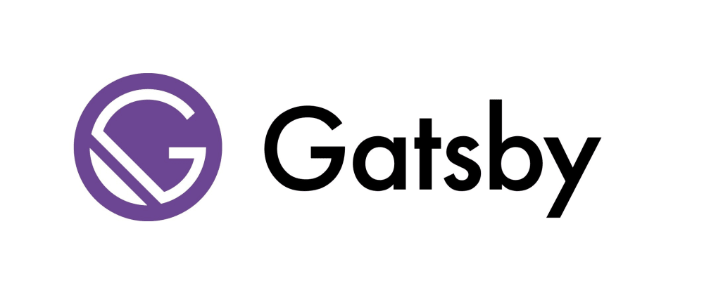

import { Card } from "@fusuma/client";

<!-- sectionTitle: motivation -->

## 1.ブログを作り直す動機

---

<Card
  left={
    <>
      
    </>
  }
  right={
    <ul>
      <li>
        元々Gatsby.js で作ったブログを運用していた
        <ul>
          <li>インターンの頃に書いたコードのため、散らかっている箇所がある</li>
          <li>リファクタリングしてもしっくりこない</li>
        </ul>
      </li>
      <li>2020年っぽい技術スタックで作り直したい</li>
      <li>
        縛り無しで理想の技術選定を行ったらどんな開発体験になるのか知りたい
      </li>
    </ul>
  }
/>
