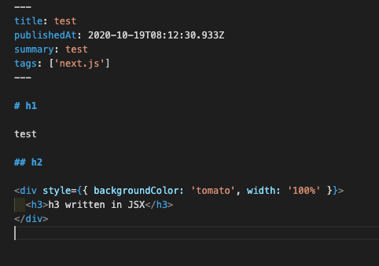
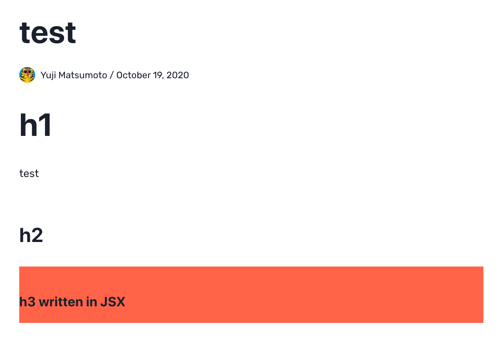
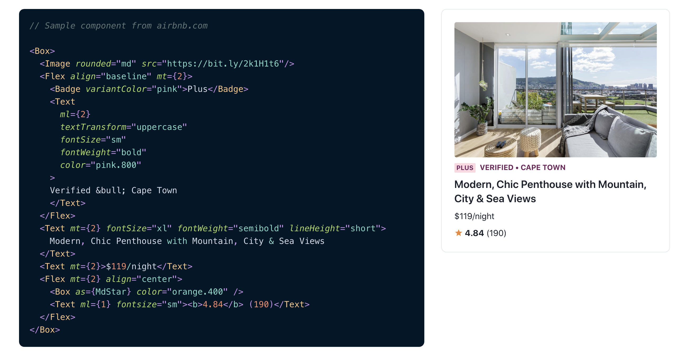
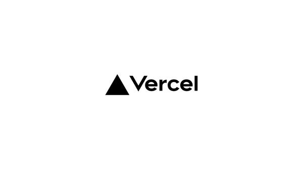

import { Card, Img } from "@fusuma/client";

<!-- sectionTitle: tech -->

## 2.技術選定

---

## [Next.js](https://nextjs.org/)

<Card
  left={
    <>
      
    </>
  }
  right={
    <>
      <ul>
        <li>
          React.js で Server Side Rendering + Static Site Generation
          をやるためのフレームワーク
        </li>
        <li>
          zero config で動く
          <ul>
            <li>自分で Webpack / Babel / TypeScript の設定をしなくても良い</li>
          </ul>
        </li>
        <li>vercel によって開発されている</li>
      </ul>
    </>
  }
/>

---

## [mdx](https://mdxjs.com/)

- 基本は markdown と同じ
- markdown の中に JSX が書ける

<Card
  left={
    <>
      
    </>
  }
  right={
    <>
      
    </>
  }
/>

---

- Provider の設定をすることで、markdown 中の要素を任意の component で読み込むことができる

```js
const MDXComponents = {
  h1: (props) => <H1 {...props} />,
  h2: (props) => <DocsHeading as="h2" size="lg" fontWeight="bold" {...props} />,
  h3: (props) => <DocsHeading as="h3" size="md" fontWeight="bold" {...props} />,
  h4: (props) => <DocsHeading as="h4" size="sm" fontWeight="bold" {...props} />,
  h5: (props) => <DocsHeading as="h5" size="xs" fontWeight="bold" {...props} />,
  h6: (props) => <DocsHeading as="h6" size="xs" fontWeight="bold" {...props} />,
  p: (props) => <Text as="p" mt={4} lineHeight="tall" {...props} />,
  ul: (props) => (
    <Box as="ul" pt={2} pl={4} ml={2} css={{ width: "100%" }} {...props} />
  ),
  ol: (props) => (
    <Box as="ol" pt={2} pl={4} ml={2} css={{ width: "100%" }} {...props} />
  ),
  li: (props) => <Box as="li" pb={1} css={{ width: "100%" }} {...props} />,
  blockquote: Quote,
};
```

```js
import { MDXProvider } from "@mdx-js/react";

// MDXProvider にcomponents を渡す
<MDXProvider components={MDXComponents}>
  <Component {...pageProps} />
</MDXProvider>;
```

---

## [Chakra](https://chakra-ui.com/)

<ul>
  <li>UI ライブラリ</li>
  <li>
    CSS を React component の props で書ける
    <ul>
      <li>
        例: marginTop={2} mb={4}
      </li>
      <li>Flex などの量産されがちな component を提供してくれる</li>
      <li>padding fontSize color 等のtheming がやりやすい</li>
    </ul>
  </li>
</ul>


---



---

## vercel

- フロントエンドアプリケーションを deploy するための PaaS
- Next.js を開発している企業によって提供されているので、相性が良い
- pull request 毎に staging 環境を deploy できる
- master に merge される度に自動 production deploy といったことができる


