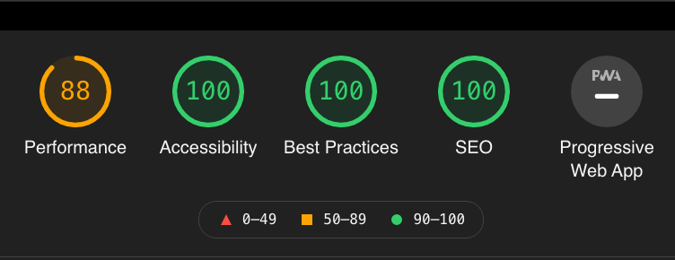
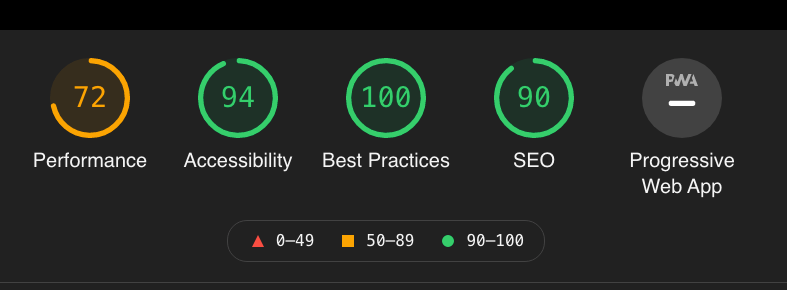
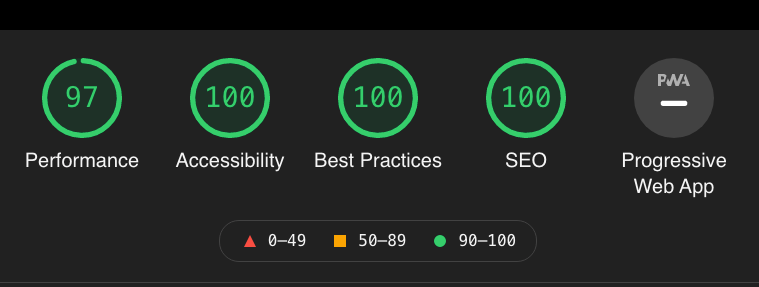

import { Card } from "@fusuma/client";

## 3. 困ったこと

---

## Chakra UI の TypeScript の型が間違っている

<br />
<br />

- Chakra UI の component は `as` prop でどの DOM で render するかを指定できる
- `as="a"` と書くと`<a />` として render される
  - ただし、`as` で指定した要素の props / attribute が型情報に含まれていないため、TypeScript の error が起きてしまう
  - ↓ は `href` が`<Box />` の type に存在していないと怒られる例

<br />

```js
<Box as="a" href={`#${id}`} />
```

---

### とりあえず GitHub の Issue を見に行く

<br />
<br />

- https://github.com/chakra-ui/chakra-ui/issues/247
- https://github.com/chakra-ui/chakra-ui/issues/906

- 次の major version の release で直りそう？
  - rc 版を install して使う

<br />

```bash
$ yarn add @chakra-ui/core@1.0.0-rc.5
```

---

- 次の version から Chakra の API がかなり変わりそう
  - 新しい document を見ながら migration をする
  - https://next.chakra-ui.com/docs/migration

<br />

=> 正しい型定義で Chakra を使えるようになった 🎉

---

## 出来上がったサイトの perf がそこまで高くない

<Card
  left={
    <>
      index page
      
    </>
  }
  right={
    <>
      post page
      
    </>
  }
/>

<br />
<br />

- lighthouse の report を見ると、Total Blocking Time の score が低い
  - JavaScript の読み込みに時間が掛かっている
  - https://web.dev/lighthouse-total-blocking-time/?utm_source=lighthouse&utm_medium=lr

---

## 重いライブラリを軽いものに変えれば改善するのでは？ 🤔

<br />

- このアプリケーションで一番重いのは React
- React を Preact に書き換える

---

## Preact

<br />

<Card
  left={
    <>
      
    </>
  }
  right={
    <ul>
      <li>React とほぼ同じAPI を提供しているライブラリ</li>
      <li>
        bundle size が小さい
        <ul>
          <li>約20 kB</li>
          <li>React + React-DOM は合計約120 kb</li>
        </ul>
      </li>
      <li>Next.js と一緒に使うことができる</li>
    </ul>
  }
/>

---

### 必要なライブラリをインストールする

<br />

```bash
$ yarn add　preact preact-render-to-string
```

---

### Alias を貼る

<br />

- npm install 時に package 名に alias を貼ることができる ([参考](https://github.com/npm/rfcs/blob/latest/implemented/0001-package-aliases.md#detailed-explanation))
  - `react` という名前で`preact/compat` をインストールしている
  - alias を貼りながら React を Preact に置き換えることで、React に依存しているライブラリの挙動が壊れない

<br />

```bash
$ yarn add react@npm:@preact/compat@^0.0.3
```

---

### Webpack の設定をいじる

<br />

- (省略します)
- 気になる方は[プルリクエスト](https://github.com/queq1890/shuho/pull/41)を見てください

---

### 置き換えた結果

<br />

<Card
  left={
    <>
      index page
      
    </>
  }
  right={
    <>
      post page
      
    </>
  }
/>

=> まだまだ改善の余地はあるものの、マシになった 🥳
